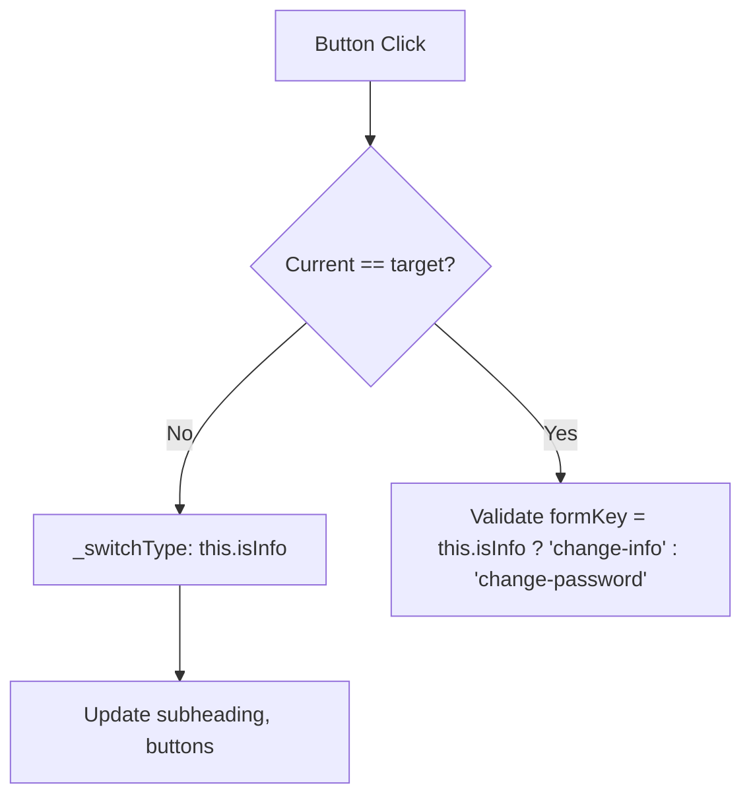

# Conditional Rendering Options for SettingsPage

## Current State
- Uses [`this.configs.type`](src/pages/settings/ui/SettingsPage.ts:245) (`\"change-info\" | \"change-password\"`) 
- Multiple string comparisons in:
  - [getInnerMarkup template](src/pages/settings/ui/SettingsPage.ts:269) - note: current {{#if isInfo}} likely broken as `isInfo` not in HB context (configs only)
  - [_switchType](src/pages/settings/ui/SettingsPage.ts:220)
  - Button click handlers (lines 119,153)

## Goals
- Reduce string literal comparisons
- Improve maintainability
- Fix potential template rendering issue
- Minimize changes

## Options

### Option 1: Add `isInfo: boolean` to `configs`
**Description:** Extend [SettingsProps](src/pages/settings/model/types.ts) with `isInfo: boolean`. Set/maintain it alongside `type`.

**Pros:**
- Direct boolean checks: `this.configs.isInfo`
- Available in HB context automatically

**Cons:**
- Slight redundancy (sync with `type`)

**Steps:**
1. Add to types: `isInfo: boolean`
2. Set in [params.ts](src/pages/settings/config/params.ts): `isInfo: true`
3. In `_switchType`: `this.configs.isInfo = type === \"change-info\"`
4. Replace all `type === \"change-info\"` with `configs.isInfo`
5. Template: `{{#if isInfo}}` (now works via context)

### Option 2: Class getter `isInfo()` + Dynamic template interpolation (Recommended)
**Description:** Add protected getter. Use in JS logic. For template, compute edge key dynamically and interpolate with `${}`.

**Pros:**
- Centralized logic
- No type/prop changes
- Fixes template: no HB conditional needed, dynamic key selection
- HB standard, no helpers needed

**Cons:**
- Single compare centralized

**Code Example:**
```typescript
// In SettingsPage class
protected get isInfo(): boolean {
  return this.configs.type === \"change-info\";
}

// Updated getInnerMarkup
public getInnerMarkup(): string {
  const inputsKey = this.isInfo ? \"inputsEditors_profile\" : \"inputsEditors_password\";

  if (!this.children?.nodes)
    return /*html*/ `<span>ERROR: SettingsPage: Children are not defined</span>`;

  const nodes = this.children.nodes as SettingsNodes;

  return /*html*/ `
    <header class=\"${css.profileHeadings}\">
      {{{ ${nodes[\"heading_profile\"].params.configs.id} }}}
      {{{ ${nodes[\"heading_backToChats\"].params.configs.id} }}}
    </header>
    
    <main class=\"${css.settingsContent}\">
      <div class=\"${css.settingsFace}\">
        <label for=\"avatar-input\" class=\"${css.avatarContainer}\">
          
          <div class=\"${css.avatarOverlay}\">
            <span class=\"${css.overlayText}\">change avatar</span>
          </div>
        </label>
        <input id=\"avatar-input\" type=\"file\" name=\"avatar\" class=\"${css.avatarFileInput}\" />
        <h2 class=\"${css.settingsFace__name}\">{{ profileName }}</h2>
      </div>

      <div class=\"${css.settingsInputs}\">
        {{{ ${nodes[\"subheading_form\"].params.configs.id} }}}

        <div class=\"${css.settingsInputs__list}\">
          {{{ ${inputsKey} }}}
        </div>
      </div>
    </main>

    <footer class=\"${css.settingsFooter}\">
      <div class=\"${css.settingsFooter__horBtns}\">
        {{{ ${nodes[\"buttonEditInfo\"].params.configs.id} }}}
        {{{ ${nodes[\"buttonEditPassword\"].params.configs.id} }}}
      </div>
      {{{ ${nodes[\"buttonLogout\"].params.configs.id} }}}
    </footer>
  `;
}
```

**Other changes:**
- In `_switchType`: `const isInfo = this.isInfo;`
- In button handlers: `const notInfo = !this.isInfo;`

### Option 3: Dynamic input edges
(Same as before)

### Option 4: CSS-based visibility
(Same)

## Recommended: Option 2 (minimal, fixes template, centralized)

## Flow Diagram

